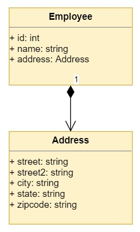

# Relasi antar objek

Berikut ini merupakan contoh komposisi / relasi antar objek dalam paradigma OOP menggunakan bahasa pemrograman Python.

```Python
class Alamat:
    def __init__(self, nama_jalan, kelurahan, kecamatan, kabupaten, propinsi, kode_pos):
        self.nama_jalan = nama_jalan
        self.kelurahan = kelurahan
        self.kecamatan = kecamatan
        self.kabupaten = kabupaten
        self.propinsi = propinsi
        self.kode_pos = kode_pos

    def __str__(self):
        return f"{self.nama_jalan} \nKel. {self.kelurahan}, Kec. {self.kecamatan}, Kab. {self.kabupaten} \n{self.propinsi} {self.kode_pos}"

class Pegawai:
    def __init__(self, nip, nama):
        self.nip = nip
        self.nama = nama
        self.alamat = None

    def set_alamat(self, alamat):
        self.alamat = alamat

    def get_alamat(self):
        return self.alamat

yoga = Pegawai("198901012019031005", "Yoga")
yoga.set_alamat(Alamat("Jl. Anggrek no. 17, Perumahan ITERA", "Way Huwi", "Jati Agung", "Lampung Selatan", "Lampung", 35365))

print(yoga.get_alamat())
```

Luaran yang tercetak ke layar adalah sebagai berikut:

```bash
Jl. Anggrek no. 17, Perumahan ITERA
Kel. Way Huwi, Kec. Jati Agung, Kab. Lampung Selatan
Lampung 35365
```

Perhatikan dalam kode diatas, dalam kelas `Pegawai` kita dapat memberikan atribut berupa objek dari kelas lainnya yaitu `Alamat`. Komposisi dalam OOP merupakan relasi objek A **memiliki (*has a*)** objek B. Dalam hal ini, kita dapat melihat relasi bahwa `Pegawai` dapat memiliki `Alamat` rumah.

Berikut ini merupakan diagram UML yang menunjukkan relasi antara `Pegawai` dan `Alamat` (diagram UML-nya mirip namun tidak sama).



Sumber Gambar: [RealPython](https://realpython.com/inheritance-composition-python/#composition-in-python)

Referensi lebih lanjut: [RealPython - Inheritance and Composition](https://realpython.com/inheritance-composition-python/)
