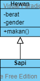

# Python Inheritance

Pewarisan memungkinkan penggunaan kembali kode yang sudah pernah dibuat. Pewarisan memodelkan hubungan `adalah` atau `is a` *relationship*. Kelas anak mewarisi atribut dan fungsi kelas orang tuanya.

```Python
class Hewan:
    def __init__():
        self.berat
        self.gender
    
    def makan():
        pass

# Sapi mewarisi atribut dan fungsi kelas Hewan
class Sapi(Hewan):
    pass
```

Kode diatas dapat dilihat hubungan antara kelas `Sapi` dan `Hewan` sebagai `Sapi adalah Hewan`. Berikut ini adalah diagram UML yang setara untuk kode diatas.



Kelas utama dalam Python adalah kelas `object`. Seluruh objek dalam Python secara implisit mewarisi atribut dan fungsi dari kelas `object`. Pengecualian diberikan untuk tipe kelas `Exception`. Pada Python versi 3.x kita tidak perlu secara eksplisit menuliskan bahwa sebuah kelas mewarisi kelas `objek`.

```Python
# Python 2.x
class Hewan(object):
    pass

# Python 3.x
class Tumbuhan:
    pass

hewan = Hewan()
tumbuhan = Tumbuhan()

# pemanggilan kedua fungsi ini seharusnya menghasilkan nilai yang sama
# kedua kelas ini mewarisi atribut dan fungsi yang ada pada kelas `object`
dir(hewan)
dir(tumbuhan)
```

Proses membuat objek juga sering disebut sebagai proses instansiasi.
